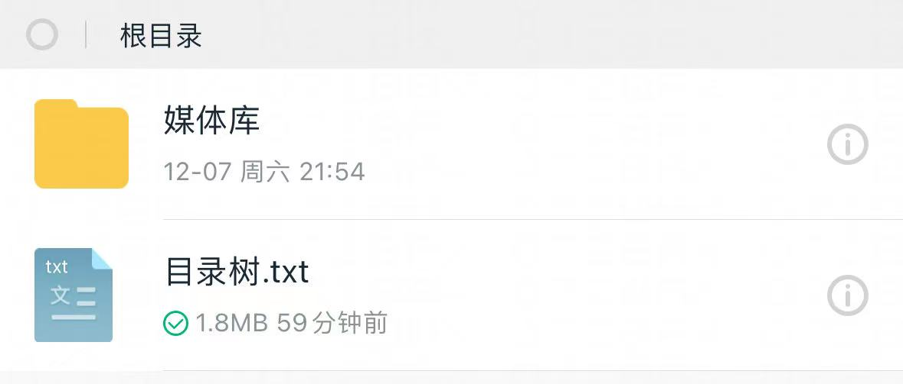

# 115-strm

通过 115 网盘生成下载目录树，自动生成 strm 文件，使用 alist 的情况下，可添加到 emby 进行播放

原理：每小时获取一次 115 网盘内的 `目录树.txt`，并生成（更新） strm 文件。
>PS: 由于 alist 默认有文件缓存 30 分钟后，所以115网盘内的目录树更新后，strm 文件可能在下一个整点更新，也可能在第二个整点更新。

镜像内置的定时任务配置为：`0 * * * * sleep $((RANDOM % 60)) && /app/main.py`。如果不满足要求可自行修改。

创建 `docker-compose.yml` 文件

```yml
services:
    alpine:
        image: ghcr.io/uwang/115-strm:latest
        container_name: alist-strm
        environment:
          - ALIST_HOST=192.168.1.100
          - ALIST_PORT=5244
          - ALIST_115_MOUNT_PATH=/115
          - ALIST_115_TREE_FILE=/目录树.txt
          - EXCLUDE_OPTION=1
          - UPDATE_EXISTING=0
          - DELETE_ABSENT=1
          - ALIST_115_TREE_FILE_FOR_GUEST=/115/目录树.txt
          - MEDIA_EXTENSIONS=mp3,flac,wav,aac,ogg,wma,alac,m4a,aiff,ape,dsf,dff,wv,pcm,tta,mp4,mkv,avi,mov,wmv,flv,webm,vob,mpg,mpeg,iso
          - TZ=Asia/Shanghai
        volumes:
            - '/path/to/strm:/data'
        restart: 'unless-stopped'
```

## 环境变量：alist

- alist 里需要关闭签名。关闭签名:
    1. 在管理-设置-全局-关闭签名所有。
    2. 在储存-挂载的储存-启用签名选择关闭
- alist 里需要启用 guest 用户，给 115 对应文件的 webdav 读权限

相关环境变量：

```env
ALIST_HOST=192.168.1.100       # alist 主机的 ip
ALIST_PORT=5244                # alist 主机的端口
ALIST_115_MOUNT_PATH=/115      # 115网盘在 alist 中的挂载路径

# 可选配置，用于探测目录树的 sha1 是否改变，需启用 guest 用户，并给 guest 用户 webdav 读取权限
ALIST_115_TREE_FILE_FOR_GUEST=/115/目录树.txt
```

## 环境变量：115网盘

假设 115 网盘的目录结构如下：

```txt
.
├── 媒体库
└── 目录树.txt
```



则 ALIST_115_TREE_FILE 填写 `/目录树.txt`，EXCLUDE_OPTION 填写 `1`

```env
ALIST_115_TREE_FILE=/目录树.txt  # 每次在115网盘根目录生成目录树文件，并将其改为固定名称 目录树.txt
EXCLUDE_OPTION=1                # 可选配置，排除的目录，一级目录填 1
```

## 其他环境变量

```env
UPDATE_EXISTING=0 # 可选配置，默认 0 不更新，是否已存在的 strm 文件。1 更新
DELETE_ABSENT=1   # 可选配置，默认 1 删除，是否删除目录树中不存在的 strm 文件。0 不删除

# 可选配置，自定义生成 strm 文件的文件后缀名，不需要的可以删除
MEDIA_EXTENSIONS=mp3,flac,wav,aac,ogg,wma,alac,m4a,aiff,ape,dsf,dff,wv,pcm,tta,mp4,mkv,avi,mov,wmv,flv,webm,vob,mpg,mpeg,iso
```

## 启动服务

确认上述环境变量后，启动服务：

```bash
docker compose up -d
```

## 文件后缀列表

常见媒体文件后缀：

- 音频文件格式：mp3,flac,wav,aac,ogg,wma,alac,m4a,aiff,ape,dsf,dff,wv,pcm,tta
- 视频文件格式：mp4,mkv,avi,mov,wmv,flv,webm,vob,mpg,mpeg,iso
- 光盘镜像文件格式：iso

## 分享音乐

<https://115.com/s/swhsphs33xj?password=0000#>
音乐 22 万首 14.39T 音乐包 1
访问码：0000

<https://115.com/s/swhsphb33xj?password=0000#>
音乐 22 万首 14.39T 音乐包 2
访问码：0000

<https://115.com/s/swhspho33xj?password=0000#>
音乐 22 万首 14.39T 音乐包 3
访问码：0000

## 测试环境

系统 ubuntu20<br>
安装好 python3、sqlite3<br>
执行需要 sudo 权限<br>
alistV3.39.1<br>
使用 strm，alist 需要关闭签名，如果你不使用 strm，只是建立 alist 的搜索数据库，则不需要关闭签名<br><br>
关闭签名方法:在管理-设置-全局-关闭签名所有，在储存-挂载的储存-启用签名选择关闭<br><br>
emby 版本： 4.9.0.30 测试版<br><br>
播放音乐，需要关闭音频转码，在设置-用户-编辑-如有必要，在媒体播放期间允许音频转码 <br><br>

## 生成文件的目录树

最好是将要处理的文件放在一个目录，生成教程<br><br>
<https://115.com/115115/T496626.html><br><br>

下载后将目录树放到 ubuntu 的目录

## 脚本

最好在存放目录树的地方执行脚本

```bash
sudo bash -c "$(curl -fsSL https://raw.githubusercontent.com/suixing8/115-strm/main/115-strm.sh)"
```

## 使用教程

1: 将目录树转换为目录文件<br><br>
2: 生成 .strm 文件<br><br>
3: 建立 alist 索引数据库<br><br>
4: 高级配置（处理非常见媒体文件时使用）<br><br>


### 1: 将目录树转换为目录文件

可下载后上传到服务器后输入完整路劲，也可以生成后的文件放到有 alist 挂载的目录，输入 alist 的下载链接
1 是必操作项，2 或者 3，根据自己的需求使用<br><br>


### 2: 生成 .strm 文件

输入 .strm 文件保存的路径<br><br>
<br><br>

输入 alist 的 ip 地址+端口<br><br>
<br><br>
请输入 alist 存储里对应的挂载路径信息<br><br>
<br><br>
请输入剔除选项（输入要剔除的目录层级数量，默认为 2）多了或者少了，自己调整一下，下面会解释原理<br><br>
<br><br>

剔除的目录层级的解释，目的就是为了生成的 strm 结构能和 alist 的结构一致，不想了解直接默认 2，<br><br>
我贴出我的示例，我在 115，长按电视剧文件夹，生成目录树，alist 根文件夹 ID，也是电视剧这个目录的 id
<br><br>

我在 alist 挂载的是/每日更新/电视剧/国产剧（115）这个目录<br><br>
<br><br>

alist 挂载是不显示目录的 id 的文件名的，所以直接显示 115 网盘电视剧目录下的文件<br><br>
<br><br>

115 目录树在生成的时候，会多自动多生成建立目录树文件的上一级目录
也就是我生成电视剧这个文件夹的目录树的时候，目录树会生成/我的资源/电视剧
所以 115 自动生成的目录树对于 alist 来说，多了 2 层目录，这种情况下，默认剔除 2 层目录，看不懂就多实践<br><br>

等待处理后，strm 文件创建到此结束<br><br>
<br><br>
strm 文件测试，随便打开一个 strm 文件，复制链接粘贴到浏览器打开，能下载就是没问题的<br><br>

<br><br>

### 3: 建立 alist 索引数据库

alsit 版本不能太低，最好在 v3.37.x 以后的版本,

如果你执行脚本的服务器和 alist 的服务器不在同一个系统，需要将 alsit 停止后，备份 data.db 数据库，将 data.db 数据库文件存放到脚本执行的目录<br><br>
如果你执行脚本的服务器和 alist 的服务器在同一个系统，需要将 alsit 停止后，备份 data.db 数据库，输入 alist 的数据路文件路劲就可以<br><br>

在主页面选择 3<br><br>
脚本会自动获取当前的文件提供选择,剔除路径和新增路劲跟生成 strm 同理<br><br>


<br><br>

根据实际情况选择替换还是新增到数据路的索引表，这个只会修改数据库的索引表，不会进行其他操作<br><br>


<br><br>
如果你执行脚本的服务器和 alist 的服务器不在同一个系统，需要执行多这一步，如果你第一步直接填写的 alist 数据库文件，不需要此步骤<br><br>
将 data.db 上传到 alist 目录，替换 data.db，再次提醒 data.db 提前备份，<br><br>

<br><br>

在 alist 设置-索引，设置为数据库(非全文搜索)，点击保存就可以了
<br><br>

开启 alist，以下为效果，理论上，你可以将整个 115 网盘都挂载到 alist，并且在 alist 上就可以搜索和观看<br><br>

<br><br>

如果你是苹果手机，推荐使用 Fileball，使用 alist 添加后，不能是 webdav 的方式添加，添加后，选择搜索，全局搜索，可以直接调用 alist 的 api 进行搜索
这个比较适合看电影电视剧综艺，因为 Fileball 不支持音乐，这个是目前我所使用的众多 app 中，唯一一个支持调用 alist 搜索 api 的<br><br>

<br><br>

# 最后，转发请注明出处

感谢 ChatGPT-4o 提供的代码<br><br>
联系<https://t.me/gengpengw>
